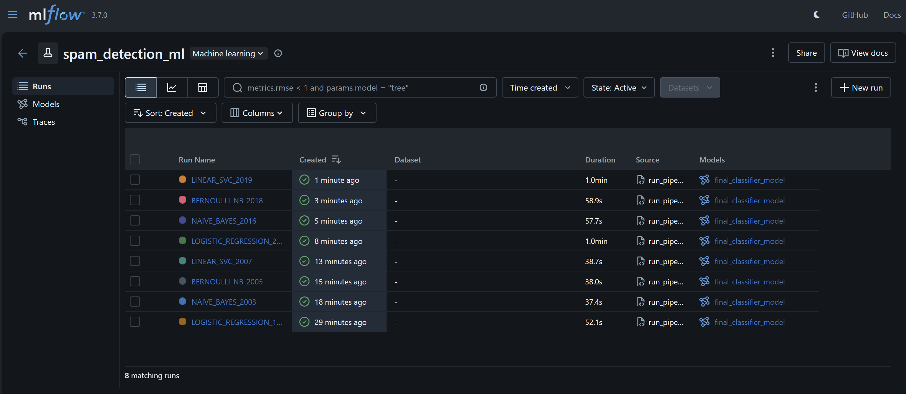
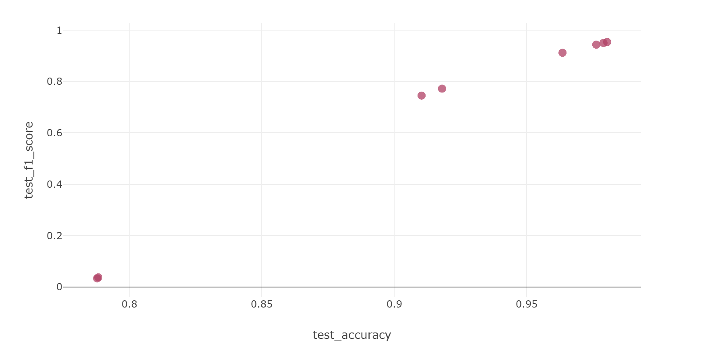
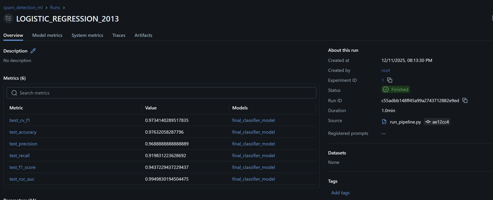
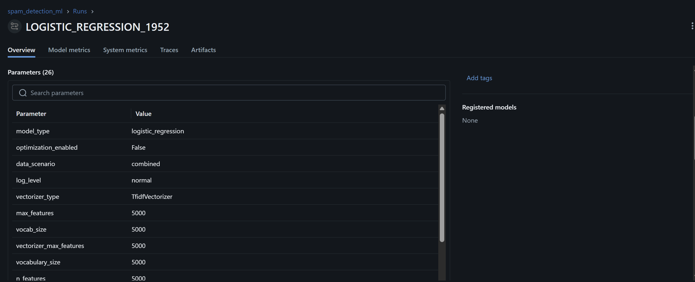
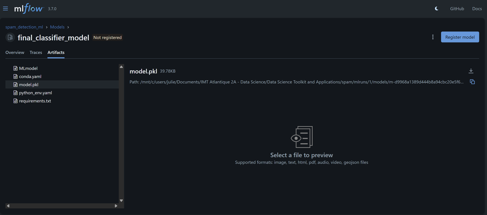

# Spam Detection ML Pipeline

A machine learning pipeline for **spam detection** on SMS and email messages using text-based features.

**Authors**
* BENDAHMAN Meryem : Model Evaluation, Model Testing
* FAURIE Juliette : Model Training, Model Testing, Documentation
* FLICHY Astrid : Model Testing, Documentation
* PHAM Ngoc Thu Uyen: Data Processing, Model Testing
* POKHAREL Sushant: Feature Engineering, MLflow Integration

## Overview

This project implements a complete, **CRISP-DM aligned machine learning pipeline** for classifying **SMS and email messages as spam or ham (non-spam)**. The goal is to turn raw, heterogeneous message data into **reliable, explainable predictions** that can support downstream applications such as email filtering, SMS gateways, or customer support tools.

The project’s objectives are twofold:

1. **Technical Objective**
   Develop and evaluate multiple supervised learning models (Logistic Regression, Naive Bayes, Linear SVM) for **binary text classification**, using:

   * Robust text preprocessing (normalization, token replacement such as `<num>`),
   * TF-IDF feature extraction,
   * Class balancing and cross-validation,
   * Optional MLflow-based experiment tracking and model comparison.

2. **Business Objective**
   Provide **reliable, interpretable spam filters** that can:

   * Reduce user exposure to fraudulent or malicious content,
   * Improve the productivity of end-users and support teams by filtering out noise,
   * Serve as a **teaching / benchmarking pipeline** for text classification best practices.

The work sits primarily in the **Modeling and Evaluation phases of CRISP-DM**, focusing on how model performance (Accuracy, Precision, Recall, F1, AUC) connects to **false positives / false negatives trade-offs** that matter for real-world systems (e.g., not hiding legitimate emails, aggressively blocking known spam patterns).

---

## Dataset Description

The project uses **two distinct but related datasets**, both included under the `data/` directory and provided as part of the course materials.

### 1. SMS Spam Dataset

A classic SMS spam dataset, containing short messages labeled as spam or ham.

* **File:** `data/sms_spam.csv`

* **Format:** Semicolon-separated (`;`)

* **Shape:** 5,572 messages × 5 columns (raw), internally reduced to `message` + `label`

* **Columns (raw):**

  * `label`: numeric spam indicator (0/1, later mapped to ham/spam)
  * `message`: SMS text
  * `Unnamed: 2`, `Unnamed: 3`, `Unnamed: 4`: unused / empty columns from original source

* **Label distribution:**

  | Class    | Count | Approx. Share |
  | -------- | ----- | ------------- |
  | Ham (0)  | 4,825 | ~87%          |
  | Spam (1) | 747   | ~13%          |

This dataset is **moderately imbalanced**, requiring class balancing strategies (e.g. oversampling) for robust training.

### 2. Email Spam Dataset

A richer **email corpus**, including metadata and message body, with a spam label.

* **File:** `data/email_spam.csv`

* **Format:** Comma-separated (`,`)

* **Shape:** 5,809 emails × 7 columns

* **Columns:**

  * `sender`: sender identifier or email address
  * `receiver`: receiver identifier or email address
  * `date`: email timestamp
  * `subject`: email subject line
  * `message`: email body (plain text)
  * `label`: spam/ham indicator (0/1)
  * `urls`: number of URLs (or related indicator) in the email

* **Label distribution:**

  | Class    | Count | Approx. Share |
  | -------- | ----- | ------------- |
  | Ham (0)  | 4,091 | ~70%          |
  | Spam (1) | 1,718 | ~30%          |

Compared to SMS, the email dataset is **less imbalanced** and offers **richer contextual features** (subject, sender, URL count).

### Experimental Scenarios

The `DataProcessor` is designed to support multiple experimental setups:

* **SMS-only** training and evaluation,
* **Email-only** training and evaluation,
* **Transfer learning**: train on SMS and evaluate on Email (or vice versa),
* **Combined dataset**: concatenate SMS and Email into a single training corpus.

This enables investigation of **domain transfer**, robustness to different text styles, and the impact of combining multiple sources.

---

## Project Structure

The repository follows a **modular, reproducible layout**, aligned with CRISP-DM phases and standard MLOps practices.

```text
spam-main/
├─ src/
│  ├─ pipeline/
│  │  ├─ data_processor.py       # Data loading, cleaning, splitting, class balancing
│  │  ├─ text_preprocessor.py    # Text normalization + TF-IDF/Count vectorization
│  │  ├─ model_trainer.py        # Model creation, training, comparison
│  │  └─ evaluator.py            # Metrics, CV evaluation, optional MLflow hooks
│  └─ utils/
│     ├─ config.py               # Central configuration (paths, model types, vectorizer, etc.)
│     ├─ evaluation_utils.py     # Confusion matrix, ROC/PR curves, plotting helpers
│     ├─ logger.py               # Structured logging with steps/substeps
│     └─ utils.py                # Generic helpers (plot setup, summary printing, etc.)
│
├─ scripts/
│  ├─ run_pipeline.py            # End-to-end training/evaluation pipeline (optional MLflow tracking)
│  └─ run_tests.py               # Test runner with cryptographic proof generation
│
├─ data/
│  ├─ sms_spam.csv               # SMS dataset (semicolon-separated)
│  └─ email_spam.csv             # Email dataset (comma-separated)
│
├─ notebooks/
│  └─ spam.ipynb                 # Exploratory notebook used during development
│
├─ tests/                        # Component-level tests (data, preprocessor, trainer, evaluator)
│
├─ assets/                        # Screenshots of Mlflow experiments and visualizations
│
├─ test_results.json             # Latest test results snapshot
├─ test_proof.json               # Cryptographic proof of test execution (if enabled)
│
├─ pyproject.toml                # Project metadata and dependencies
├─ requirements.txt              # Alternative dependency list (pip)
├─ uv.lock                       # Lockfile for uv-based installation
└─ README.md                     # Project documentation
```

### Design Rationale

* **Separation of concerns:**
  Each module focuses on a single responsibility: data handling, text preprocessing, model training, evaluation, or utilities.

* **Reproducibility:**
  The entire pipeline can be launched via `scripts/run_pipeline.py`, and tests via `scripts/run_tests.py`, starting from raw CSV files.

* **Experimentation-friendly:**
  Support for multiple models, comparison mode, and optional MLflow logging makes it easy to extend experiments or plug in new classifiers.

* **Teaching-friendly:**
  The repository includes **tests + cryptographic proof** for verifiable technical validation, ideal for grading or automated assessment.

---

## Installation

From the project root:

```bash
cd spam

# Option 1: Using uv (recommended if available)
uv sync --extra dev

# Quick technical validation (without full coverage/proof)
uv run python scripts/run_tests.py --quick
```

Alternatively, using `pip`:

```bash
pip install -r requirements.txt

# Run tests
python scripts/run_tests.py --quick
```

---

## Usage

### Basic Pipeline

Run the default pipeline (combined dataset, default model, standard configuration):

```bash
uv run python scripts/run_pipeline.py
```

Typical steps executed:

1. Load SMS + Email datasets,
2. Clean and standardize text (e.g. lowercasing, `<num>` token for numbers),
3. Balance classes (oversampling minority class where appropriate),
4. Split into train/test sets (stratified),
5. Vectorize text using **TF-IDF** (or CountVectorizer based on config),
6. Train the chosen model and evaluate it on the test set,
7. Optionally log results to MLflow (if enabled).

### Model Selection and Comparison

Select a specific classifier:

```bash
# Logistic Regression
uv run python scripts/run_pipeline.py --model logistic_regression

# Multinomial Naive Bayes
uv run python scripts/run_pipeline.py --model naive_bayes

# Bernoulli Naive Bayes
uv run python scripts/run_pipeline.py --model bernoulli_nb

# Linear SVM (LinearSVC)
uv run python scripts/run_pipeline.py --model linear_svc
```

Compare **all configured models** in a single run:

```bash
uv run python scripts/run_pipeline.py --compare
```

Enable basic hyperparameter optimization (GridSearchCV for supported models):

```bash
uv run python scripts/run_pipeline.py --model logistic_regression --optimize
```

Control logging verbosity:

```bash
uv run python scripts/run_pipeline.py --log-level verbose
uv run python scripts/run_pipeline.py --log-level silent
```

### Tests and Cryptographic Proof

Run the full technical test suite with optional cryptographic proof:

```bash
# Run all tests + generate cryptographic proof (if cryptography is installed)
uv run python scripts/run_tests.py

# Quick run (subset of tests, no coverage)
uv run python scripts/run_tests.py --quick

# Module-specific tests (e.g. only DataProcessor)
uv run python scripts/run_tests.py --module data_processor

# With coverage report
uv run python scripts/run_tests.py --coverage

# Disable proof generation explicitly
uv run python scripts/run_tests.py --no-proof
```

When proof is enabled and the `cryptography` library is available, the script produces:

* `test_results.json` – structured summary of test outcomes,
* `test_proof.json` – signed metadata that can be verified by instructors.

---

## Advanced Models and MLflow Experiment Tracking

### Implemented Classifiers

The pipeline supports several **linear, interpretable baseline models** that are known to perform well on high-dimensional sparse text features:

* **Logistic Regression** (`logistic_regression`)

  * Strong baseline for text classification with TF-IDF features
  * Supports probability estimates and decision thresholds

* **Multinomial Naive Bayes** (`naive_bayes`)

  * Simple, fast, often competitive on bag-of-words / TF-IDF
  * Works well when word counts/frequencies distinguish spam vs ham

* **Bernoulli Naive Bayes** (`bernoulli_nb`)

  * Binary feature variant (word present / absent)
  * Useful for short texts or when frequency magnitude is less informative

* **Linear SVM** (`linear_svc`)

  * Maximizes margin in high-dimensional space
  * Strong performance on sparse text; particularly robust decision boundary

Vectorization is controlled via `utils/config.py`:

* `VECTORIZER_TYPE`: `"TfidfVectorizer"` or `"CountVectorizer"`
* `MAX_FEATURES`: maximum number of vocabulary features

Hyperparameter tuning (when `--optimize` is set) uses **GridSearchCV** over compact grids defined in `config.py` to keep experiments reproducible and training times manageable.

### MLflow Experiment Tracking

The pipeline is integrated with MLflow for robust experiment tracking and model versioning. Every run logs the model configuration, feature extraction parameters, and a comprehensive set of classification metrics, ensuring full reproducibility.

#### Main Tracked Runs (Experiment Summary)

The following table summarizes the eight experiments conducted and logged in the MLflow UI. The comparison highlights the impact of hyperparameter optimization (--optimize) on model performance.

| Run Name | Model | Dataset Variant | Vectorizer | Balancing | Optimization | Notes |
| --- | --- | --- | --- | --- | --- | --- |
| **Logistic Regression** | LogisticRegression | Combined | TfidfVectorizer | Yes | No | Base model performance (Benchmark). |
| **Linear SVM** | LinearSVC | Combined | TfidfVectorizer | Yes | No | Base model performance (Benchmark). |
| **Naive Bayes** | GaussianNB | Combined | TfidfVectorizer | Yes | No | Base model performance (Benchmark). |
| **Bernoulli Naive Bayes** | BernoulliNB | Combined | TfidfVectorizer | Yes | No | Base model, very poor Recall and F1 Score. |
| **Logistic Regression (Optimized)** | LogisticRegression | Combined | TfidfVectorizer | Yes | Yes | Best ROC-AUC. Optimized C-parameter and solver. |
| **Linear SVM (Optimized)** | LinearSVC | Combined | TfidfVectorizer | Yes | Yes | Best F1 Score. Optimized C-parameter. |
| **Naive Bayes (Optimized)** | GaussianNB | Combined | TfidfVectorizer | Yes | Yes | Optimized model, showing decent performance. |
| **Bernoulli Naive Bayes (Optimized)** | BernoulliNB | Combined | TfidfVectorizer | Yes | Yes | Optimized model. Performance remains the lowest. |

**Visualizing the Experiments**:

The MLflow UI provides a central dashboard for comparing all runs at a glance.



#### Aggregated Metrics (Performance Comparison)

The final performance evaluation was performed on the test set. The table below presents the full results, with a clear separation between base models and their optimized counterparts.

| Model | Dataset | Accuracy | Precision (Spam) | Recall (Spam) | F1 (Spam) | ROC-AUC |
| --- | --- | --- | --- | --- | --- | --- |
| **Logistic Regression (Base)** | Combined | 0.9635 | 0.9518 | 0.8755 | 0.9120 | 0.9883 |
| **LinearSVC (Base)** | Combined | 0.9790 | 0.9732 | 0.9282 | 0.9502 | N/A |
| **Naive Bayes (Base)** | Combined | 0.9102 | 0.9632 | 0.6075 | 0.7451 | 0.9409 |
| **Bernoulli NB (Base)** | Combined | 0.7877 | 1.0000 | 0.0168 | 0.0331 | 0.6858 |
| **Logistic Regression (Optimized)** | Combined | 0.9763 | 0.9688 | 0.9198 | 0.9437 | **0.9949** |
| **LinearSVC (Optimized)** | Combined | **0.9804** | 0.9654 | 0.9430 | 0.9541 | N/A |
| **Naive Bayes (Optimized)** | Combined | 0.9180 | 0.9327 | 0.6434 | 0.7721 | 0.9514 |
| **Bernoulli NB (Optimized)** | Combined | 0.7825 | 1.0000 | 0.0189 | 0.0372 | 0.7067 |

**Conclusion and Business Trade-offs**: 

The **Optimized LinearSVC** achieved the highest F1 Score (**0.9541**), establishing it as the most balanced classifier for this test set. The F1 Score represents a critical balance between **Precision** (minimizing False Positives – ensuring legitimate emails are not blocked) and **Recall** (minimizing False Negatives – ensuring actual spam is detected).

* **LinearSVC (Optimized)**: Offers the best compromise (Precision 0.9654 / Recall 0.9430).
* **Logistic Regression (Optimized)**: Demonstrated the best overall discriminative power (ROC-AUC: **0.9949**), which is crucial for setting deployment-time decision thresholds.

Optimization provided the most significant F1 gain for the Logistic Regression model and the Naive Bayes model.

#### Visualizing Performance Differences

MLflow's comparison feature allows for quick visualization of metric gains across runs, providing evidence of successful optimization.

The scatter plot below charts the relationship between Test Accuracy (X-axis) and Test F1 Score (Y-axis) for all eight runs.



**Interpretation of the Scatter Plot**:
- **Top Cluster (Ideal Models)**: The points clustered in the upper-right corner (F1 Score $\approx 0.94-0.95$ and Accuracy $\approx 0.96-0.98$) represent the Linear SVM and Logistic Regression models, confirming their status as the top-performing algorithms.
- **Performance Gaps**: The significant vertical distance between the top cluster and the mid-range points (F1 Score $\approx 0.74-0.77$, Naive Bayes) and the lowest point (F1 Score $\approx 0.03$, Bernoulli NB) highlights the clear performance advantage of the SVM and Logistic Regression families for this task.

#### Traceability and Reproducibility

##### Best Run Details

The following capture shows the detailed metrics logged for the Optimized Logistic Regression run, which yielded the best ROC-AUC score. This provides the exact metric values for the final model.



##### Parameter Logging

MLflow automatically logs all parameters, ensuring the exact feature engineering setup and the model's hyperparameters are captured. This capture confirms the use of TfidfVectorizer and a vocab_size of 5000.



#### Artifacts and Model Versioning

The pipeline automatically logs the final trained classifier model as an artifact. This ensures that the exact model instance responsible for the recorded metrics is saved and ready for deployment or loading.



**Note**: More screenshots detailing individual experiments and visualizations are available in the assets/ folder of this repository.

## Methodology

### Data Preprocessing

* Read SMS/Email datasets from `data/` using robust CSV parsing that:

  * Handles different delimiters (semicolon vs comma),
  * Normalizes schemas to a common `(message, label)` interface.
* Remove duplicates and obvious corrupted rows.
* Map labels into a consistent target column defined in `config.py`:

  * `TARGET_COL = "label"`
  * `POSITIVE_CLASS_LABEL = "spam"` (after mapping 0/1 to ham/spam)
* Perform **train/test splits** using stratified sampling to preserve the spam ratio.

Class imbalance is mitigated through **oversampling** of the minority class in the training data when required.

### Text Preprocessing and Feature Engineering

Implemented in `TextPreprocessor`:

* Lowercasing text,
* Replacing digit sequences with a `<num>` token,
* Collapsing multiple spaces and trimming whitespace,
* Vectorization using either **TF-IDF** or **CountVectorizer** (configurable),
* Limiting the vocabulary size (`MAX_FEATURES`) to avoid overfitting and speed up training.

This yields a high-dimensional sparse matrix that feeds directly into scikit-learn models.

### Model Training and Evaluation

Model training is orchestrated by `ModelTrainer`:

* Builds the chosen classifier according to `MODEL_TYPES` from config,
* Trains on vectorized features,
* Optionally compares multiple models in a single run (`--compare`),
* Delegates evaluation to `Evaluator`.

The `Evaluator` provides:

* Train/test evaluation with **Accuracy, Precision, Recall, F1**,
* Cross-validation utilities (e.g. K-fold, StratifiedKFold),
* Optional MLflow logging hooks (disabled unless `--mlflow` is set).

Additional visual diagnostics are provided in `evaluation_utils.py`:

* **Confusion matrix** plots,
* **ROC curves** and AUC,
* **Precision–Recall curves**.

These tools help reason about **false positive vs false negative trade-offs**, which are critical in spam filtering applications.

---

## Key Insights and Next Steps

From a **data perspective**:

* The SMS dataset is **heavily imbalanced** (~13% spam), while the email dataset is less so (~30% spam).
* Email messages bring richer metadata (subject, sender, URL count) that can be leveraged for more advanced models later (e.g. feature crosses, embeddings).

From a **modeling perspective**:

* The pipeline is designed so that **linear baselines** (Logistic Regression, Linear SVM) can serve as strong, interpretable starting points.
* Naive Bayes models provide fast, baseline performance, ideal for quick prototyping or resource-constrained environments.

For **future work**, you can:

* Add experiment configurations for:

  * SMS-only vs Email-only vs Combined vs Transfer,
  * Different vectorizer types and feature limits.
* Populate the **MLflow tables** in this README with real results from your experiments.
* Introduce more advanced models (e.g. Gradient Boosting, shallow neural networks) for comparison.
* Explore **threshold tuning** based on business constraints (e.g. minimize false positives vs maximize spam catch rate).

---
